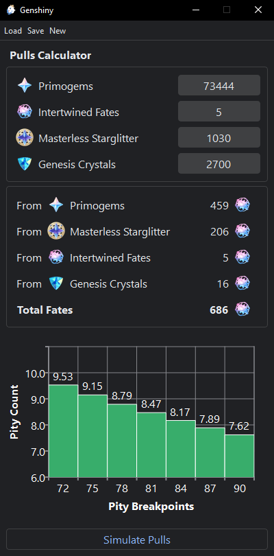
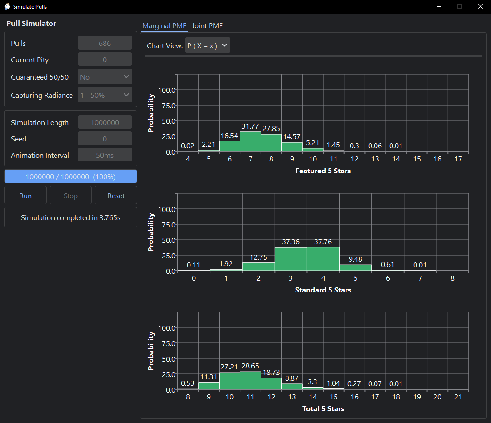
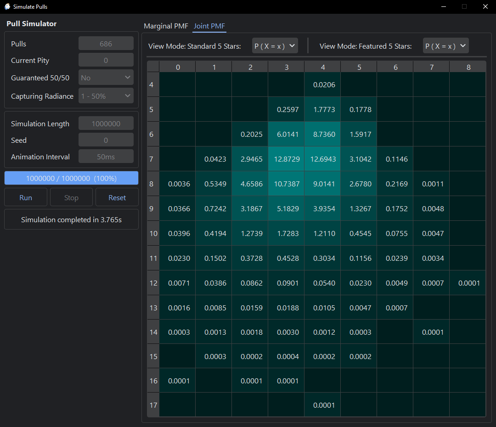

# Genshiny
[](https://www.python.org/)
[](https://www.rust-lang.org/)
[](LICENSE)

A desktop application for managing and analyzing your pulls in Genshin Impact.

## 📋 Overview

Genshiny helps players track their gacha resources and simulate pull outcomes using the best known approximation of the Genshin Impact gacha model. The application provides offline data management with a clean, user-friendly interface.

## ✨ Features

- **Resource Tracking**: Monitor Primogems, Intertwined Fates, Masterless Starglitter, and Genesis Crystals
- **Offline Storage**: Save and load your currency data locally, no online connection needed
- **Pull Calculator**: Calculate your total available pulls from your resources
- **Guarantee Counter**: Determine how many guaranteed 5-star characters you can obtain
- **Gacha Simulation**: Simulate pulls using an approximate gacha model including the effect of Capturing Radiance
- **Dark Theme**: Modern UI with dark theme support

## 📷 Screenshots

<p align="center">
    
</p>
<p align="center">
    
</p>
<p align="center">
    
</p>

## 📦 Installation

Download the latest release [here](https://github.com/ganpm/genshiny/releases).

You can also clone the repo and compile the simulation model yourself, and then build the standalone executable.

## 🛠️ Build

### Prerequisites

- **Python 3.12.0** or later
- **Rust 1.82.0** or later

Follow the steps below to manually build the program as a standalone file on Windows.

1. **Clone the repository**

    ```sh
    git clone https://github.com/ganpm/genshiny
    cd genshiny
    ```

2. **Create and activate virtual environment**

    ```sh
    python -m venv .venv
    .\.venv\Scripts\Activate.ps1
    ```

3. **Install dependencies**
   
    ```sh
    pip install -r requirements.txt
    pip install pyqtdarktheme==2.1.0 --ignore-requires-python
    ```

    > **Note:** The second command is required due to a known issue with `pyqtdarktheme` installation.
    >
    > See [PyQtDarkTheme GitHub Issue #252](https://github.com/5yutan5/PyQtDarkTheme/issues/252) for details.

4. **Build the simulation model library**

    Compile the simulation model library using `maturin` with the `--release` flag to enable optimization.

    ```sh
    maturin develop --release
    ```

    At this point you should be able to run it without building the executable using the following command:

    ```sh
    python Genshiny.py
    ```

5. **Build the standalone executable**

    Build the standalone executable using `nuitka`.

    ```sh
    python -m nuitka Genshiny.py
    ```
    
    The build configuration is specified in the `Genshiny.py` file.

6. **Run the program**

    The `Genshiny.exe` executable file should appear in the same folder.

    > **Note:** Creates a folder named `genshiny_save` on first launch in the same folder where the executable is.

## 📚 Technical References

The gacha simulation models are based on the following:

- **Wish Model**: [Statistical model for Genshin Impact's droprates | HoYoLAB](https://www.hoyolab.com/article/497840)
- **Capturing Radiance Model**: [Understanding Genshin Impact's Capturing Radiance: In-Depth Analysis of 4 Million Pulls : r/Genshin_Impact](https://www.reddit.com/r/Genshin_Impact/comments/1hd1sqa/understanding_genshin_impacts_capturing_radiance/)

## 🤝 Contributing

Contributions are welcome! Please feel free to submit issues and pull requests.

## 📄 License

This project is licensed under the GNU General Public License v3.0 - see the [LICENSE](LICENSE) file for details.

## ⚠️ Disclaimer

This application is not affiliated with HoYoverse. Genshin Impact is a trademark of HoYoverse.